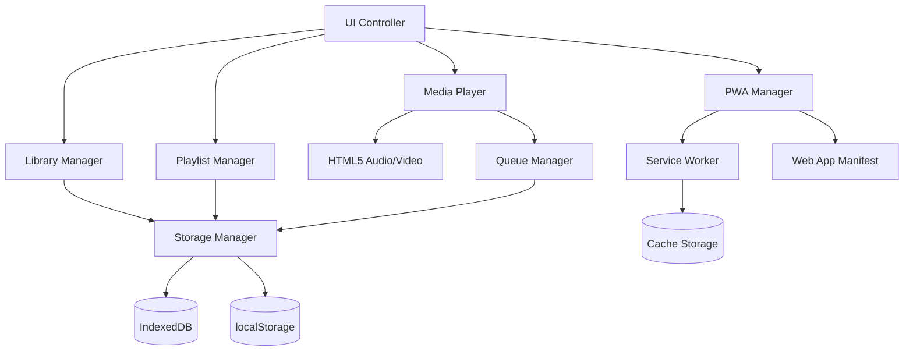
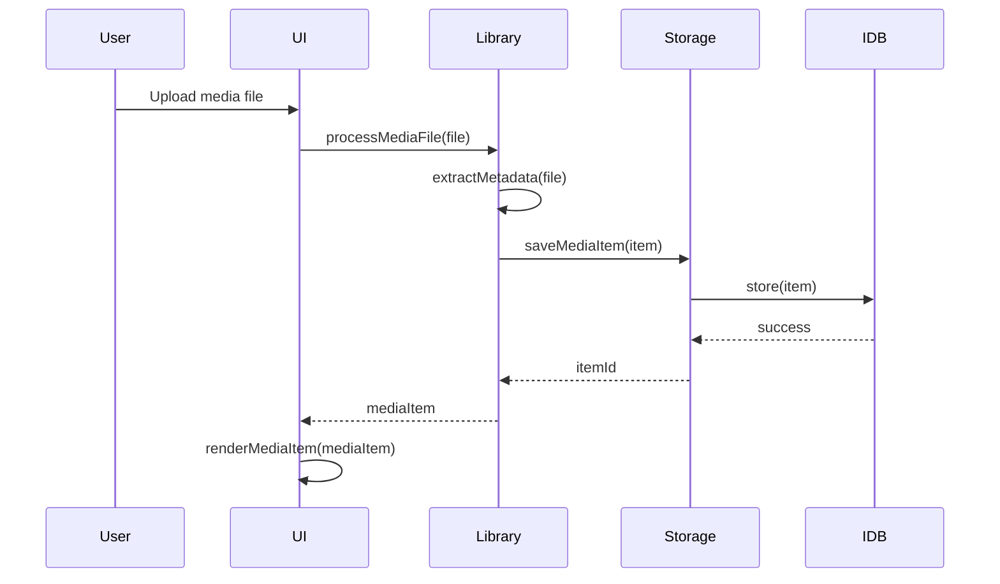

# Design Document: Personal Music Web App

## Overview

The Personal Music Web App is a client-side Progressive Web Application (PWA) that provides a YouTube Music-inspired interface for managing and playing personal audio and video content. The application is designed to be deployed on GitHub Pages as a static web app with no server-side dependencies.

### Key Design Goals

1. **Offline-First Architecture**: Leverage PWA capabilities to enable full functionality without network connectivity
2. **Client-Side Data Management**: Store all media files and metadata locally using IndexedDB and localStorage
3. **Responsive Design**: Provide seamless experience across desktop and mobile devices
4. **Performance Optimization**: Handle large media libraries (100+ items) efficiently through virtual scrolling and lazy loading
5. **Static Deployment**: Ensure compatibility with GitHub Pages hosting constraints

### Technology Stack

- **Frontend**: Vanilla JavaScript (ES6+), HTML5, CSS3
- **Storage**: IndexedDB (media files), localStorage (preferences, playlists)
- **Media Playback**: HTML5 Audio/Video APIs
- **PWA**: Service Worker API, Cache API, Web App Manifest
- **Metadata Extraction**: HTML5 Media Element APIs with loadedmetadata event
- **Performance**: Intersection Observer API (lazy loading), Virtual scrolling implementation

### Research Findings

Based on research into modern PWA best practices:

1. **IndexedDB for Media Storage**: IndexedDB is designed for storing large amounts of structured data including Blob objects ([javascript.info](https://javascript.info/indexeddb)). It's the appropriate choice for storing media file references and metadata in offline-first applications.

2. **Service Worker Caching Strategies**: Different resource types require different caching strategies ([magicbell.com](https://www.magicbell.com/blog/offline-first-pwas-service-worker-caching-strategies)):
   - **Cache-First**: Static assets (HTML, CSS, JS) that rarely change
   - **Network-First with Cache Fallback**: Dynamic content and API-like operations
   - **Stale-While-Revalidate**: Images and media posters for instant loads with background updates

3. **Metadata Extraction**: HTML5 audio/video elements provide basic metadata (duration, dimensions) via the `loadedmetadata` event. For ID3 tags (artist, title, album), dedicated libraries like `music-metadata` are required ([tutorialspoint.com](https://www.tutorialspoint.com/article/accessing-metadata-from-an-audio-files-using-javascript)).

4. **Virtual Scrolling**: For lists exceeding 100 items, virtual scrolling renders only visible items plus a buffer, keeping DOM node count constant regardless of dataset size ([coreui.io](https://coreui.io/answers/how-to-implement-virtual-scrolling-in-javascript/)).

## Architecture

### High-Level Architecture



### Component Architecture

The application follows a modular architecture with clear separation of concerns:

1. **Presentation Layer**: UI Controller manages DOM manipulation and user interactions
2. **Business Logic Layer**: Library Manager, Playlist Manager, Queue Manager handle application logic
3. **Media Layer**: Player component wraps HTML5 media APIs
4. **Data Layer**: Storage Manager abstracts IndexedDB and localStorage operations
5. **Infrastructure Layer**: PWA Manager handles service worker and offline capabilities

### Data Flow



## Components and Interfaces

### 1. UI Controller

**Responsibility**: Manages all user interface rendering, navigation, and user interactions.

**Key Methods**:
```javascript
class UIController {
  // Navigation
  navigateTo(view: string): void
  showSidebar(): void
  hideSidebar(): void
  
  // Rendering
  renderMediaGrid(items: MediaItem[]): void
  renderPlaylist(playlist: Playlist): void
  renderQueue(queue: MediaItem[]): void
  renderPlayerBar(currentItem: MediaItem): void
  
  // Search
  handleSearchInput(query: string): void
  highlightSearchResults(query: string): void
  
  // Modals and Dialogs
  showUploadDialog(): void
  showEditDialog(item: MediaItem): void
  showConfirmDialog(message: string): Promise<boolean>
  showErrorMessage(error: Error): void
  
  // Responsive
  handleResize(): void
  toggleMobileMenu(): void
}
```

**State Management**:
- Current view (home, songs, videos, playlists)
- Sidebar visibility
- Search query
- Selected media type filter
- Mobile menu state

### 2. Library Manager

**Responsibility**: Manages the media library including adding, editing, and removing media items.

**Key Methods**:
```javascript
class LibraryManager {
  // Media Management
  async addMediaFile(file: File, poster?: File): Promise<MediaItem>
  async addMediaBatch(files: File[]): Promise<MediaItem[]>
  async updateMediaItem(id: string, updates: Partial<MediaItem>): Promise<void>
  async deleteMediaItem(id: string): Promise<void>
  
  // Metadata
  async extractMetadata(file: File): Promise<MediaMetadata>
  validateMediaFile(file: File): ValidationResult
  
  // Retrieval
  async getAllMedia(): Promise<MediaItem[]>
  async getMediaByType(type: 'audio' | 'video'): Promise<MediaItem[]>
  async searchMedia(query: string): Promise<MediaItem[]>
  
  // Poster Management
  async updatePoster(itemId: string, posterFile: File): Promise<void>
  generateDefaultPoster(item: MediaItem): string
}
```

**Validation Rules**:
- Audio formats: MP3, M4A, WAV, OGG
- Video formats: MP4, WEBM, OGV
- Max file size: 500 MB
- Poster formats: JPEG, PNG, WEBP
- Max poster size: 5 MB
- Max poster dimensions: 2000x2000 pixels
- Title max length: 200 characters
- Artist max length: 100 characters

### 3. Playlist Manager

**Responsibility**: Manages playlist creation, modification, and organization.

**Key Methods**:
```javascript
class PlaylistManager {
  // Playlist CRUD
  async createPlaylist(name: string): Promise<Playlist>
  async renamePlaylist(id: string, newName: string): Promise<void>
  async deletePlaylist(id: string): Promise<void>
  async getAllPlaylists(): Promise<Playlist[]>
  
  // Playlist Items
  async addToPlaylist(playlistId: string, itemId: string): Promise<void>
  async removeFromPlaylist(playlistId: string, itemId: string): Promise<void>
  async reorderPlaylist(playlistId: string, fromIndex: number, toIndex: number): Promise<void>
  async getPlaylistItems(playlistId: string): Promise<MediaItem[]>
  
  // Validation
  validatePlaylistName(name: string): boolean
}
```

**Playlist Structure**:
```javascript
interface Playlist {
  id: string;
  name: string;
  itemIds: string[];
  createdAt: number;
  updatedAt: number;
}
```

### 4. Media Player

**Responsibility**: Handles media playback, controls, and playback state management.

**Key Methods**:
```javascript
class MediaPlayer {
  // Playback Control
  async play(item: MediaItem): Promise<void>
  pause(): void
  stop(): void
  seek(time: number): void
  setVolume(level: number): void
  
  // Queue Navigation
  next(): void
  previous(): void
  skipTo(index: number): void
  
  // Playback State
  getCurrentTime(): number
  getDuration(): number
  getPlaybackState(): PlaybackState
  
  // Event Handlers
  onTimeUpdate(callback: (time: number) => void): void
  onEnded(callback: () => void): void
  onError(callback: (error: Error) => void): void
  onMetadataLoaded(callback: (metadata: MediaMetadata) => void): void
  
  // Keyboard Shortcuts
  handleKeyPress(event: KeyboardEvent): void
}
```

**Playback State**:
```javascript
enum PlaybackState {
  STOPPED = 'stopped',
  PLAYING = 'playing',
  PAUSED = 'paused',
  LOADING = 'loading',
  ERROR = 'error'
}
```

**Keyboard Shortcuts**:
- `Space`: Play/Pause
- `ArrowRight`: Seek forward 5 seconds
- `ArrowLeft`: Seek backward 5 seconds
- `ArrowUp`: Volume up
- `ArrowDown`: Volume down
- `N`: Next track
- `P`: Previous track

### 5. Queue Manager

**Responsibility**: Manages the playback queue including ordering, shuffling, and repeat modes.

**Key Methods**:
```javascript
class QueueManager {
  // Queue Management
  setQueue(items: MediaItem[]): void
  addToQueue(item: MediaItem): void
  removeFromQueue(index: number): void
  clearQueue(): void
  reorderQueue(fromIndex: number, toIndex: number): void
  
  // Navigation
  getCurrentItem(): MediaItem | null
  getNextItem(): MediaItem | null
  getPreviousItem(): MediaItem | null
  moveToNext(): MediaItem | null
  moveToPrevious(): MediaItem | null
  
  // Modes
  shuffle(): void
  unshuffle(): void
  setRepeatMode(mode: RepeatMode): void
  
  // State
  getQueue(): MediaItem[]
  getCurrentIndex(): number
  isShuffled(): boolean
  getRepeatMode(): RepeatMode
}
```

**Repeat Modes**:
```javascript
enum RepeatMode {
  OFF = 'off',
  ALL = 'all',
  ONE = 'one'
}
```

### 6. Storage Manager

**Responsibility**: Abstracts data persistence using IndexedDB and localStorage.

**Key Methods**:
```javascript
class StorageManager {
  // IndexedDB Operations (Media Files)
  async saveMediaItem(item: MediaItem): Promise<string>
  async getMediaItem(id: string): Promise<MediaItem | null>
  async getAllMediaItems(): Promise<MediaItem[]>
  async updateMediaItem(id: string, updates: Partial<MediaItem>): Promise<void>
  async deleteMediaItem(id: string): Promise<void>
  
  // localStorage Operations (Playlists, Preferences)
  savePlaylists(playlists: Playlist[]): void
  getPlaylists(): Playlist[]
  savePreferences(prefs: UserPreferences): void
  getPreferences(): UserPreferences
  savePlaybackState(state: PlaybackState): void
  getPlaybackState(): PlaybackState | null
  
  // Storage Management
  async getStorageUsage(): Promise<StorageEstimate>
  async clearAllData(): Promise<void>
  
  // Export/Import
  async exportLibrary(): Promise<Blob>
  async importLibrary(data: Blob): Promise<void>
}
```

**IndexedDB Schema**:
```javascript
// Database: MusicAppDB, Version: 1
// Object Store: mediaItems
{
  keyPath: 'id',
  indexes: [
    { name: 'type', keyPath: 'type', unique: false },
    { name: 'title', keyPath: 'title', unique: false },
    { name: 'artist', keyPath: 'artist', unique: false }
  ]
}
```

**localStorage Keys**:
- `playlists`: Array of Playlist objects
- `preferences`: UserPreferences object
- `playbackState`: Current playback state
- `mediaTypeFilter`: Selected media type filter

### 7. PWA Manager

**Responsibility**: Manages Progressive Web App features including service worker and manifest.

**Key Methods**:
```javascript
class PWAManager {
  // Service Worker
  async registerServiceWorker(): Promise<void>
  async updateServiceWorker(): Promise<void>
  onUpdateAvailable(callback: () => void): void
  
  // Installation
  onInstallPrompt(callback: (event: BeforeInstallPromptEvent) => void): void
  isInstalled(): boolean
  
  // Offline Detection
  isOnline(): boolean
  onOnline(callback: () => void): void
  onOffline(callback: () => void): void
  
  // Cache Management
  async getCacheSize(): Promise<number>
  async clearCache(): Promise<void>
}
```

**Service Worker Caching Strategy**:
- **Cache-First**: HTML, CSS, JavaScript files
- **Stale-While-Revalidate**: Poster images
- **Network-Only**: Media files (too large to cache effectively)

### 8. Virtual Scroller

**Responsibility**: Efficiently renders large lists by only displaying visible items.

**Key Methods**:
```javascript
class VirtualScroller {
  constructor(container: HTMLElement, itemHeight: number, renderItem: (item: any, index: number) => HTMLElement)
  
  // Data Management
  setItems(items: any[]): void
  updateItem(index: number, item: any): void
  
  // Scrolling
  scrollToIndex(index: number): void
  scrollToTop(): void
  
  // Lifecycle
  destroy(): void
}
```

**Implementation Details**:
- Buffer size: 5 items above and below viewport
- Item height: Fixed at 280px (250px card + 30px margin)
- Scroll throttling: 16ms (60fps)
- Reuses DOM elements for performance

## Data Models

### MediaItem

```javascript
interface MediaItem {
  id: string;                    // UUID v4
  type: 'audio' | 'video';
  title: string;                 // Max 200 characters
  artist: string;                // Max 100 characters
  duration: number;              // Seconds
  fileBlob: Blob;                // Actual media file
  posterBlob?: Blob;             // Poster image
  posterUrl?: string;            // Object URL for poster
  fileSize: number;              // Bytes
  mimeType: string;              // e.g., 'audio/mp3', 'video/mp4'
  createdAt: number;             // Unix timestamp
  updatedAt: number;             // Unix timestamp
}
```

### Playlist

```javascript
interface Playlist {
  id: string;                    // UUID v4
  name: string;
  itemIds: string[];             // References to MediaItem IDs
  createdAt: number;             // Unix timestamp
  updatedAt: number;             // Unix timestamp
}
```

### UserPreferences

```javascript
interface UserPreferences {
  theme: 'dark' | 'light';
  volume: number;                // 0-1
  repeatMode: RepeatMode;
  shuffleEnabled: boolean;
  mediaTypeFilter: 'all' | 'audio' | 'video';
  persistPlaybackPosition: boolean;
}
```

### PlaybackState

```javascript
interface PlaybackState {
  currentItemId: string | null;
  currentTime: number;
  queueItemIds: string[];
  queueIndex: number;
  isPlaying: boolean;
  timestamp: number;             // When state was saved
}
```

### MediaMetadata

```javascript
interface MediaMetadata {
  title: string;
  artist: string;
  duration: number;
  width?: number;                // For video
  height?: number;               // For video
}
```

### ValidationResult

```javascript
interface ValidationResult {
  valid: boolean;
  errors: string[];
}
```

### StorageEstimate

```javascript
interface StorageEstimate {
  usage: number;                 // Bytes used
  quota: number;                 // Bytes available
  percentage: number;            // Usage percentage
}
```

## Correctness Properties

*A property is a characteristic or behavior that should hold true across all valid executions of a system—essentially, a formal statement about what the system should do. Properties serve as the bridge between human-readable specifications and machine-verifiable correctness guarantees.*

Before writing correctness properties, I need to analyze the acceptance criteria to determine which are suitable for property-based testing.


### Property Reflection

After analyzing all acceptance criteria, I've identified the following consolidation opportunities:

**Redundancy Analysis:**

1. **Storage Round-Trip Properties**: Multiple criteria test saving and retrieving data (2.2, 2.7, 10.1, 10.2, 10.3, 10.4, 13.4). These can be consolidated into comprehensive round-trip properties for each storage type.

2. **Filtering Properties**: Criteria 1.3, 1.4, 1.5, 1.6 all test media type filtering. These can be combined into properties about filter state management.

3. **Playlist Operations**: Criteria 2.3, 2.4, 2.5, 2.6 test individual playlist operations. While each is distinct, they share the property that operations should persist correctly.

4. **Queue Operations**: Criteria 5.1, 5.2, 5.3, 5.4, 5.5 test queue manipulation. These can be consolidated into properties about queue invariants.

5. **Search Properties**: Criteria 7.1, 7.2, 7.4, 7.5 test search behavior. These can be combined into comprehensive search properties.

6. **Validation Properties**: Criteria 3.1, 3.4, 3.5 test validation. These can be consolidated into properties about validation rules.

7. **Deletion Cascade**: Criteria 12.3, 12.4, 12.5 test deletion and its cascading effects. These can be combined into a single comprehensive deletion property.

**Retained Properties**: After consolidation, the following unique properties provide comprehensive coverage without redundancy.

### Property 1: Media Type Filter Persistence Round-Trip

*For any* media type filter selection (audio, video, or all), saving the selection and reloading the application SHALL restore the same filter state and display only items matching that filter.

**Validates: Requirements 1.3, 1.4, 1.5, 1.6**

### Property 2: Playlist Creation and Persistence

*For any* valid playlist name, creating a playlist SHALL result in a persisted playlist that can be retrieved and contains the correct name.

**Validates: Requirements 2.1, 2.2**

### Property 3: Playlist Item Management Preserves Integrity

*For any* playlist and any media item, adding the item to the playlist and then removing it SHALL return the playlist to its original state with the same item count and contents.

**Validates: Requirements 2.3, 2.4, 2.7**

### Property 4: Playlist Modifications Persist

*For any* playlist modification (rename, add item, remove item, delete), the modification SHALL be immediately reflected in localStorage and persist across application reloads.

**Validates: Requirements 2.5, 2.6, 2.7**

### Property 5: File Validation Rejects Invalid Media

*For any* file that does not match supported formats (MP3, M4A, WAV, OGG, MP4, WEBM, OGV) or exceeds 500 MB, the validation SHALL reject the file and prevent it from being added to the library.

**Validates: Requirements 3.1**

### Property 6: Metadata Extraction Fallback

*For any* media file where metadata extraction fails or times out, the system SHALL use the filename as the title and "Unknown" as the artist, ensuring every media item has valid metadata.

**Validates: Requirements 3.3**

### Property 7: Poster Validation Enforces Constraints

*For any* poster image file, validation SHALL enforce format requirements (JPEG, PNG, WEBP), maximum file size (5 MB), and maximum dimensions (2000x2000 pixels), rejecting files that violate any constraint.

**Validates: Requirements 3.4**

### Property 8: Metadata Edit Validation

*For any* metadata edit operation, validation SHALL enforce title length ≤ 200 characters and artist length ≤ 100 characters, rejecting edits that exceed these limits.

**Validates: Requirements 3.5**

### Property 9: Media Upload Round-Trip

*For any* valid media file, uploading the file SHALL result in a media item stored in IndexedDB that can be retrieved with the same file content and metadata.

**Validates: Requirements 3.6, 3.8**

### Property 10: Batch Upload Processes All Files

*For any* batch of files up to 50 items, batch upload SHALL process all files and result in all valid files being added to the library.

**Validates: Requirements 3.7**

### Property 11: Queue Auto-Advance

*For any* queue with multiple items, when the current item ends, the player SHALL automatically advance to the next item in the queue until the queue is exhausted.

**Validates: Requirements 4.6**

### Property 12: Playback State Persistence Round-Trip

*For any* playback state (current item, position, queue), saving the state and reloading the application SHALL restore the exact same playback state.

**Validates: Requirements 4.8, 13.1, 13.2, 13.4**

### Property 13: Queue Shuffle Preserves Items

*For any* queue, shuffling SHALL preserve the exact set of items (same count, same items) while changing their order.

**Validates: Requirements 5.6**

### Property 14: Queue Reordering Maintains Integrity

*For any* queue and any valid reorder operation (moving item from index A to index B), the reordered queue SHALL contain the same items with the moved item at the new position and all other items maintaining their relative order.

**Validates: Requirements 5.2**

### Property 15: Queue Item Removal

*For any* queue and any item in the queue, removing the item SHALL result in a queue with count decreased by one and the removed item no longer present.

**Validates: Requirements 5.4**

### Property 16: Search Results Match Query

*For any* search query and any media library, all returned results SHALL have either title or artist containing the search query (case-insensitive), and no items matching the query SHALL be excluded.

**Validates: Requirements 7.1, 7.2, 7.4, 7.5**

### Property 17: Empty Search Returns All Items

*For any* media library, an empty search query SHALL return all items in the library without filtering.

**Validates: Requirements 7.4**

### Property 18: Touch Target Minimum Size

*For any* interactive element in the UI, the element SHALL have dimensions of at least 44x44 pixels to meet touch target accessibility requirements.

**Validates: Requirements 8.4**

### Property 19: Service Worker Registration Error Logging

*For any* service worker registration failure, the PWA Manager SHALL log an error message to the console indicating the registration failure.

**Validates: Requirements 9.3**

### Property 20: Storage Round-Trip for Playlists

*For any* playlist data, saving to localStorage and retrieving SHALL return data equivalent to the original playlist data.

**Validates: Requirements 10.1, 10.4**

### Property 21: Storage Round-Trip for Media References

*For any* media item reference, saving to IndexedDB and retrieving SHALL return a reference equivalent to the original media item.

**Validates: Requirements 10.2, 10.4**

### Property 22: Storage Round-Trip for Preferences

*For any* user preferences object, saving to localStorage and retrieving SHALL return preferences equivalent to the original preferences.

**Validates: Requirements 10.3, 10.4**

### Property 23: Storage Quota Exceeded Handling

*For any* storage operation that would exceed the quota, the Storage Manager SHALL catch the quota exceeded error and display a user-friendly notification suggesting data cleanup.

**Validates: Requirements 10.5**

### Property 24: Library Export-Import Round-Trip

*For any* media library state, exporting the library and then importing the exported data SHALL restore the library to an equivalent state with the same media items and playlists.

**Validates: Requirements 10.6, 10.7**

### Property 25: Relative Path Usage

*For any* asset reference in the application (images, scripts, stylesheets), the reference SHALL use a relative path rather than an absolute path.

**Validates: Requirements 11.2**

### Property 26: Subdirectory Path Compatibility

*For any* base path (including subdirectories), the application SHALL load and function correctly when served from that path.

**Validates: Requirements 11.4**

### Property 27: Media Item Deletion Cascade

*For any* media item that exists in one or more playlists, deleting the item SHALL remove it from all playlists and from IndexedDB storage.

**Validates: Requirements 12.3, 12.4, 12.5**

### Property 28: Deletion Confirmation Display

*For any* media item deletion attempt, the UI SHALL display a confirmation dialog before proceeding with the deletion.

**Validates: Requirements 12.6**

### Property 29: Completed Item Position Clearing

*For any* media item that plays to completion, the saved playback position for that item SHALL be cleared.

**Validates: Requirements 13.5**

### Property 30: Load Error Message Display

*For any* media file that fails to load, the Player SHALL display an error message that includes the filename of the failed media item.

**Validates: Requirements 14.1**

### Property 31: Unsupported Format Error Message

*For any* file upload with an unsupported format, the Library Manager SHALL display a format error message indicating the file type is not supported.

**Validates: Requirements 14.3**

### Property 32: Error Console Logging

*For any* error that occurs in the application, the error SHALL be logged to the browser console with sufficient detail for debugging.

**Validates: Requirements 14.5**

### Property 33: User-Friendly Error Messages

*For any* error displayed to the user, the error message SHALL be in plain language without technical jargon or stack traces.

**Validates: Requirements 14.6**

### Property 34: Virtual Scrolling Activation

*For any* media library with more than 100 items, the UI SHALL activate virtual scrolling to render only visible items plus a buffer.

**Validates: Requirements 15.2**

### Property 35: Lazy Loading of Poster Images

*For any* poster image in the media library, the image SHALL only be loaded when it enters or is about to enter the viewport.

**Validates: Requirements 15.3**

### Property 36: Next Item Preloading

*For any* queue with at least two items, when an item is playing, the Player SHALL preload the next item in the queue.

**Validates: Requirements 15.4**

### Property 37: Search Input Debouncing

*For any* rapid sequence of search input changes, the search filtering operation SHALL be debounced to execute at most once per debounce interval (e.g., 300ms).

**Validates: Requirements 15.5**

## Error Handling

### Error Categories

The application handles four categories of errors:

1. **User Input Errors**: Invalid file formats, size limits, validation failures
2. **Storage Errors**: Quota exceeded, IndexedDB failures, localStorage unavailable
3. **Media Errors**: File load failures, playback errors, metadata extraction failures
4. **System Errors**: Service worker registration failures, browser compatibility issues

### Error Handling Strategy

```javascript
class ErrorHandler {
  // User-facing error display
  displayError(error: AppError): void {
    const message = this.getUserFriendlyMessage(error);
    this.uiController.showErrorMessage(message);
    this.logError(error);
  }
  
  // Console logging for debugging
  logError(error: Error): void {
    console.error('[MusicApp Error]', {
      message: error.message,
      stack: error.stack,
      timestamp: new Date().toISOString(),
      context: this.getErrorContext()
    });
  }
  
  // Convert technical errors to user-friendly messages
  getUserFriendlyMessage(error: AppError): string {
    switch (error.type) {
      case 'QUOTA_EXCEEDED':
        return 'Storage is full. Please delete some items to free up space.';
      case 'UNSUPPORTED_FORMAT':
        return `File format not supported. Please use ${SUPPORTED_FORMATS.join(', ')}.`;
      case 'FILE_TOO_LARGE':
        return `File is too large. Maximum size is ${MAX_FILE_SIZE_MB} MB.`;
      case 'LOAD_FAILED':
        return `Could not load "${error.fileName}". The file may be corrupted.`;
      case 'METADATA_TIMEOUT':
        return 'Metadata extraction timed out. Using filename as title.';
      default:
        return 'An unexpected error occurred. Please try again.';
    }
  }
}
```

### Error Recovery

**Storage Quota Exceeded**:
1. Display notification with current usage percentage
2. Suggest deleting unused items or playlists
3. Provide "Clear Cache" button to remove cached posters
4. Offer export functionality to backup before cleanup

**Media Load Failures**:
1. Display error with filename
2. Skip to next item in queue if auto-playing
3. Mark item as "unavailable" in library
4. Provide "Retry" button

**Service Worker Failures**:
1. Log error to console
2. Continue app functionality without offline support
3. Display warning about limited offline capabilities
4. Provide "Retry Registration" option

**Metadata Extraction Failures**:
1. Use filename as title
2. Set artist to "Unknown"
3. Set duration to 0 (will update when played)
4. Allow user to manually edit metadata later

### Browser Compatibility

**Required Features**:
- IndexedDB API
- Service Worker API
- HTML5 Audio/Video
- localStorage
- ES6+ JavaScript

**Feature Detection**:
```javascript
class CompatibilityChecker {
  checkCompatibility(): CompatibilityResult {
    const missing = [];
    
    if (!('indexedDB' in window)) missing.push('IndexedDB');
    if (!('serviceWorker' in navigator)) missing.push('Service Workers');
    if (!('localStorage' in window)) missing.push('localStorage');
    
    return {
      compatible: missing.length === 0,
      missingFeatures: missing
    };
  }
  
  displayCompatibilityWarning(missing: string[]): void {
    const message = `Your browser doesn't support: ${missing.join(', ')}. 
                     Some features may not work correctly. 
                     Please use a modern browser like Chrome, Firefox, or Edge.`;
    this.uiController.showWarning(message);
  }
}
```

## Testing Strategy

### Overview

The testing strategy employs a dual approach combining property-based testing for universal behaviors and example-based unit testing for specific scenarios and edge cases.

### Property-Based Testing

**Library**: [fast-check](https://github.com/dubzzz/fast-check) for JavaScript

**Configuration**:
- Minimum 100 iterations per property test
- Seed-based reproducibility for failed tests
- Shrinking enabled to find minimal failing cases

**Property Test Structure**:
```javascript
import fc from 'fast-check';

describe('Feature: personal-music-web-app, Property 1: Media Type Filter Persistence Round-Trip', () => {
  it('should restore filter state after reload', () => {
    fc.assert(
      fc.property(
        fc.constantFrom('audio', 'video', 'all'),
        (filterType) => {
          // Setup
          const storage = new StorageManager();
          const library = new MediaLibrary(storage);
          
          // Save filter
          library.setMediaTypeFilter(filterType);
          
          // Simulate reload
          const newLibrary = new MediaLibrary(storage);
          
          // Verify
          expect(newLibrary.getMediaTypeFilter()).toBe(filterType);
        }
      ),
      { numRuns: 100 }
    );
  });
});
```

**Generators**:

Custom generators for domain objects:
```javascript
// Media Item Generator
const mediaItemArb = fc.record({
  id: fc.uuid(),
  type: fc.constantFrom('audio', 'video'),
  title: fc.string({ minLength: 1, maxLength: 200 }),
  artist: fc.string({ minLength: 1, maxLength: 100 }),
  duration: fc.nat({ max: 7200 }), // Max 2 hours
  fileSize: fc.nat({ max: 500 * 1024 * 1024 }), // Max 500 MB
  mimeType: fc.constantFrom('audio/mp3', 'audio/m4a', 'video/mp4'),
  createdAt: fc.date().map(d => d.getTime()),
  updatedAt: fc.date().map(d => d.getTime())
});

// Playlist Generator
const playlistArb = fc.record({
  id: fc.uuid(),
  name: fc.string({ minLength: 1, maxLength: 100 }),
  itemIds: fc.array(fc.uuid(), { maxLength: 50 }),
  createdAt: fc.date().map(d => d.getTime()),
  updatedAt: fc.date().map(d => d.getTime())
});

// Queue Generator
const queueArb = fc.array(mediaItemArb, { minLength: 1, maxLength: 100 });

// Search Query Generator
const searchQueryArb = fc.oneof(
  fc.constant(''),
  fc.string({ minLength: 1, maxLength: 50 })
);
```

### Unit Testing

**Framework**: Jest

**Coverage Areas**:
- Specific UI interactions (button clicks, keyboard shortcuts)
- Edge cases (empty libraries, single-item queues)
- Integration points (HTML5 media APIs, browser storage)
- Error scenarios (network failures, invalid data)

**Example Unit Tests**:
```javascript
describe('MediaPlayer', () => {
  it('should play audio file when play button clicked', async () => {
    const player = new MediaPlayer();
    const audioItem = createMockAudioItem();
    
    await player.play(audioItem);
    
    expect(player.getPlaybackState()).toBe(PlaybackState.PLAYING);
  });
  
  it('should handle spacebar for play/pause', () => {
    const player = new MediaPlayer();
    const event = new KeyboardEvent('keydown', { code: 'Space' });
    
    player.handleKeyPress(event);
    
    expect(player.getPlaybackState()).toBe(PlaybackState.PLAYING);
  });
  
  it('should display error for corrupted file', async () => {
    const player = new MediaPlayer();
    const corruptedItem = createCorruptedMediaItem();
    
    await expect(player.play(corruptedItem)).rejects.toThrow();
  });
});
```

### Integration Testing

**Focus Areas**:
- Service worker caching and offline functionality
- IndexedDB operations with real browser storage
- HTML5 media playback with actual files
- PWA installation flow
- GitHub Pages deployment

**Example Integration Tests**:
```javascript
describe('PWA Offline Functionality', () => {
  it('should serve cached assets when offline', async () => {
    // Register service worker
    await navigator.serviceWorker.register('/sw.js');
    
    // Load app online
    await page.goto('http://localhost:3000');
    
    // Go offline
    await page.setOfflineMode(true);
    
    // Reload page
    await page.reload();
    
    // Verify app loads
    expect(await page.title()).toBe('Music');
  });
});
```

### Test Organization

```
tests/
├── unit/
│   ├── components/
│   │   ├── UIController.test.js
│   │   ├── MediaPlayer.test.js
│   │   ├── LibraryManager.test.js
│   │   ├── PlaylistManager.test.js
│   │   └── QueueManager.test.js
│   ├── storage/
│   │   └── StorageManager.test.js
│   └── utils/
│       ├── validation.test.js
│       └── metadata.test.js
├── property/
│   ├── filtering.property.test.js
│   ├── playlists.property.test.js
│   ├── queue.property.test.js
│   ├── search.property.test.js
│   ├── storage.property.test.js
│   └── validation.property.test.js
├── integration/
│   ├── pwa.integration.test.js
│   ├── storage.integration.test.js
│   └── playback.integration.test.js
└── e2e/
    ├── user-flows.e2e.test.js
    └── mobile.e2e.test.js
```

### Test Coverage Goals

- **Unit Tests**: 80% code coverage
- **Property Tests**: All 37 correctness properties implemented
- **Integration Tests**: All external dependencies (browser APIs, storage)
- **E2E Tests**: Critical user flows (upload, play, create playlist)

### Continuous Testing

**Pre-commit Hooks**:
- Run unit tests
- Run property tests (with reduced iterations for speed)
- Lint code

**CI Pipeline**:
- Run full test suite with 100 iterations per property
- Generate coverage report
- Run integration tests in multiple browsers
- Deploy to staging environment

## Implementation Notes

### Performance Considerations

1. **Virtual Scrolling Implementation**:
   - Use fixed item height (280px) for predictable calculations
   - Maintain 5-item buffer above and below viewport
   - Reuse DOM elements via object pooling
   - Throttle scroll events to 16ms (60fps)

2. **Lazy Loading Strategy**:
   - Use Intersection Observer API with 200px root margin
   - Load images in batches of 10
   - Implement progressive image loading (blur-up technique)
   - Cache loaded images in memory

3. **Debouncing Configuration**:
   - Search input: 300ms debounce
   - Window resize: 150ms debounce
   - Playback position save: 5000ms (5 seconds)

4. **IndexedDB Optimization**:
   - Use transactions for batch operations
   - Index frequently queried fields (type, title, artist)
   - Implement cursor-based pagination for large result sets
   - Cache frequently accessed items in memory

### Security Considerations

1. **File Upload Validation**:
   - Validate MIME type on both client and file content
   - Check magic numbers for file type verification
   - Sanitize filenames to prevent path traversal
   - Limit file sizes to prevent DoS

2. **XSS Prevention**:
   - Sanitize user input (titles, artist names, playlist names)
   - Use textContent instead of innerHTML for user data
   - Implement Content Security Policy (CSP)

3. **Data Privacy**:
   - All data stored locally (no server transmission)
   - No analytics or tracking
   - Clear data export/import for user control

### Accessibility

1. **Keyboard Navigation**:
   - All interactive elements keyboard accessible
   - Visible focus indicators
   - Logical tab order
   - Keyboard shortcuts documented

2. **Screen Reader Support**:
   - ARIA labels for all controls
   - ARIA live regions for dynamic content
   - Semantic HTML structure
   - Alt text for images

3. **Visual Accessibility**:
   - Minimum 4.5:1 contrast ratio
   - Touch targets ≥ 44x44 pixels
   - Scalable text (no fixed pixel sizes)
   - Reduced motion support

### Browser Support

**Minimum Versions**:
- Chrome 80+
- Firefox 75+
- Safari 13+
- Edge 80+

**Progressive Enhancement**:
- Core functionality works without service worker
- Graceful degradation for older browsers
- Feature detection before usage

### Deployment Checklist

- [ ] Build optimized production bundle
- [ ] Generate service worker with cache manifest
- [ ] Create web app manifest with icons
- [ ] Add .nojekyll file
- [ ] Configure relative paths
- [ ] Test on GitHub Pages subdirectory
- [ ] Verify HTTPS functionality
- [ ] Test PWA installation
- [ ] Validate offline functionality
- [ ] Check mobile responsiveness
- [ ] Run accessibility audit
- [ ] Verify browser compatibility

## Future Enhancements

### Phase 2 Features

1. **Cloud Sync**: Optional cloud backup via GitHub Gists or similar
2. **Lyrics Display**: Synchronized lyrics display during playback
3. **Equalizer**: Audio equalizer with presets
4. **Themes**: Multiple theme options beyond dark mode
5. **Sharing**: Share playlists via export/import links
6. **Statistics**: Playback history and listening statistics
7. **Smart Playlists**: Auto-generated playlists based on criteria
8. **Collaborative Playlists**: Share playlists with other users

### Technical Debt

1. **Migration to TypeScript**: Add type safety
2. **Component Framework**: Consider React or Vue for complex UI
3. **State Management**: Implement Redux or similar for complex state
4. **Testing**: Increase coverage to 90%+
5. **Performance**: Implement Web Workers for heavy operations
6. **Offline Sync**: Queue operations for offline execution

## Conclusion

This design provides a comprehensive architecture for a YouTube Music-inspired personal music web app that can be deployed on GitHub Pages. The modular component structure, clear separation of concerns, and robust error handling ensure maintainability and extensibility. The dual testing strategy with property-based testing for universal behaviors and unit testing for specific scenarios provides confidence in correctness. The PWA features enable offline functionality and native-like experience on mobile devices.
